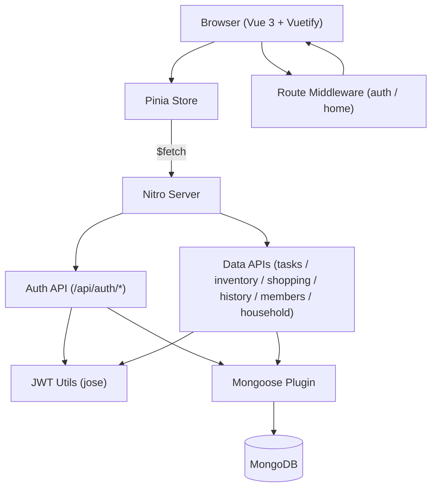

# heartshtone

Shared home dashboard for household management — tasks, inventory, shopping list, and history — with real-time persistence and secure multi-user auth.

**Stack:** Nuxt **4**, Vue **3**, Vuetify **3**, Pinia, GSAP **3**, MongoDB (Mongoose **9**), JWT (jose), TypeScript, Vitest

---

## Prerequisites

- Node.js **22+**
- pnpm **11+**
- MongoDB instance (local or Atlas)

---

## Quick Start

1. Clone repo and install deps
   ```bash
   pnpm install
   ```
2. Copy env file and fill values
   ```bash
   cp .env.example .env
   ```
3. Start dev server
   ```bash
   pnpm dev
   ```
4. Open `http://localhost:3000`

---

## Commands

| Action           | Command           |
| ---------------- | ----------------- |
| Dev server       | `pnpm dev`        |
| Production build | `pnpm build`      |
| Preview build    | `pnpm preview`    |
| Static generate  | `pnpm generate`   |
| Type check       | `pnpm typecheck`  |
| Run tests        | `pnpm test`       |
| Tests (watch)    | `pnpm test:watch` |
| Tests (UI)       | `pnpm test:ui`    |

---

## Pages

| Path         | Description                              | Access                                        |
| ------------ | ---------------------------------------- | --------------------------------------------- |
| `/`          | Home redirect                            | Public → redirects to `/dashboard` or `/auth` |
| `/auth`      | Login / register                         | Public only                                   |
| `/dashboard` | Task board with leaderboard              | Protected                                     |
| `/inventory` | Household inventory management           | Protected                                     |
| `/shopping`  | Shopping list with auto-restock flow     | Protected                                     |
| `/history`   | Checkout / restock history log           | Protected                                     |
| `/household` | Household settings and member management | Protected                                     |

---

## API Endpoints

| Method                  | Path                 | Description                             | Auth |
| ----------------------- | -------------------- | --------------------------------------- | ---- |
| `POST`                  | `/api/auth/register` | Create account, return JWT cookie       | No   |
| `POST`                  | `/api/auth/login`    | Validate credentials, return JWT cookie | No   |
| `POST`                  | `/api/auth/logout`   | Clear JWT cookie                        | No   |
| `GET`                   | `/api/auth/me`       | Current user from JWT                   | Yes  |
| `POST`                  | `/api/auth/refresh`  | Refresh JWT token                       | Yes  |
| `GET/POST/PATCH/DELETE` | `/api/tasks`         | Task CRUD                               | Yes  |
| `GET/POST/PATCH/DELETE` | `/api/inventory`     | Inventory item CRUD                     | Yes  |
| `GET/POST/PATCH/DELETE` | `/api/shopping`      | Shopping list CRUD                      | Yes  |
| `GET/POST`              | `/api/history`       | Checkout / restock history              | Yes  |
| `GET/POST/PATCH/DELETE` | `/api/members`       | Household member management             | Yes  |
| `GET/PATCH`             | `/api/household`     | Household metadata (name, emoji)        | Yes  |

---

## Architecture



Nuxt 4 compat mode — app code in `app/`, server code in `server/`. Vuetify provides the component library with a warm "Quiet Home" theme (sage green + earthy neutrals). GSAP handles page-level animations via `useAnimations` and confetti via `useConfetti`. JWT stored as httpOnly cookie; all data API routes validate via server middleware before hitting MongoDB.

---

## Source Layout

```
heartshtone/
├── app/
│   ├── assets/css/          # Design tokens and component styles
│   ├── components/          # Shared + feature components
│   │   ├── dashboard/       # TaskModal, TaskRow, Leaderboard
│   │   ├── inventory/       # Item, Modal
│   │   └── shopping/        # Item
│   ├── composables/         # useAnimations, useConfetti
│   ├── layouts/             # auth.vue, default.vue
│   ├── middleware/          # auth.ts, home.ts
│   ├── pages/               # Route pages (auth, dashboard, inventory, shopping, history, household)
│   ├── plugins/             # gsap.client.ts
│   ├── stores/              # home.ts (Pinia)
│   └── app.vue
├── server/
│   ├── api/                 # Nitro API route handlers
│   │   └── auth/            # login, logout, me, refresh, register
│   ├── middleware/          # auth.ts (JWT validation)
│   ├── models/              # Mongoose models (User, Household, Task, InventoryItem, ShoppingItem, HistoryEntry, PendingInvite)
│   ├── plugins/             # mongoose.ts (DB connection)
│   └── utils/               # jwt.ts, serialize.ts
├── tests/
│   └── unit/                # Vitest unit tests (auth, middleware, store)
├── nuxt.config.ts
├── package.json
└── .env.example
```

---

## Configuration

| Variable          | Purpose                                                             |
| ----------------- | ------------------------------------------------------------------- |
| `NUXT_MONGO_URI`  | MongoDB connection string (e.g. `mongodb://localhost:27017/hearth`) |
| `NUXT_JWT_SECRET` | Secret for signing JWT tokens (min 32 chars in production)          |
